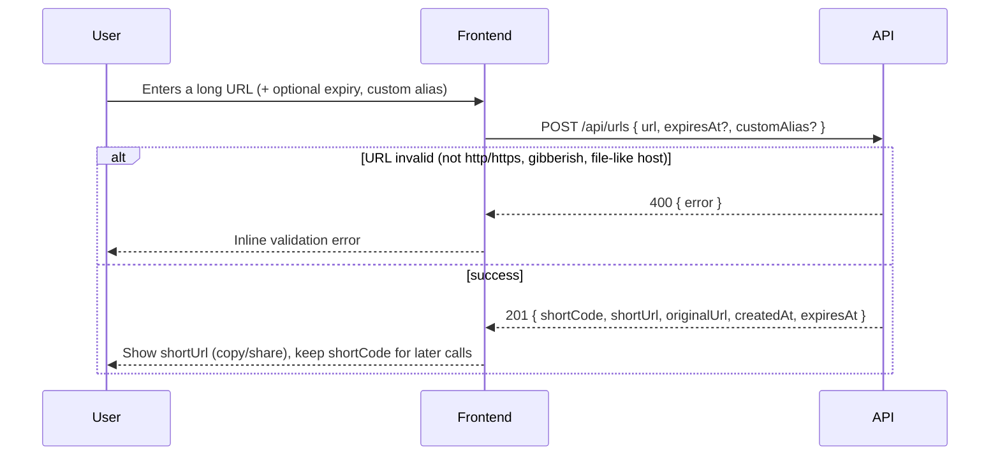
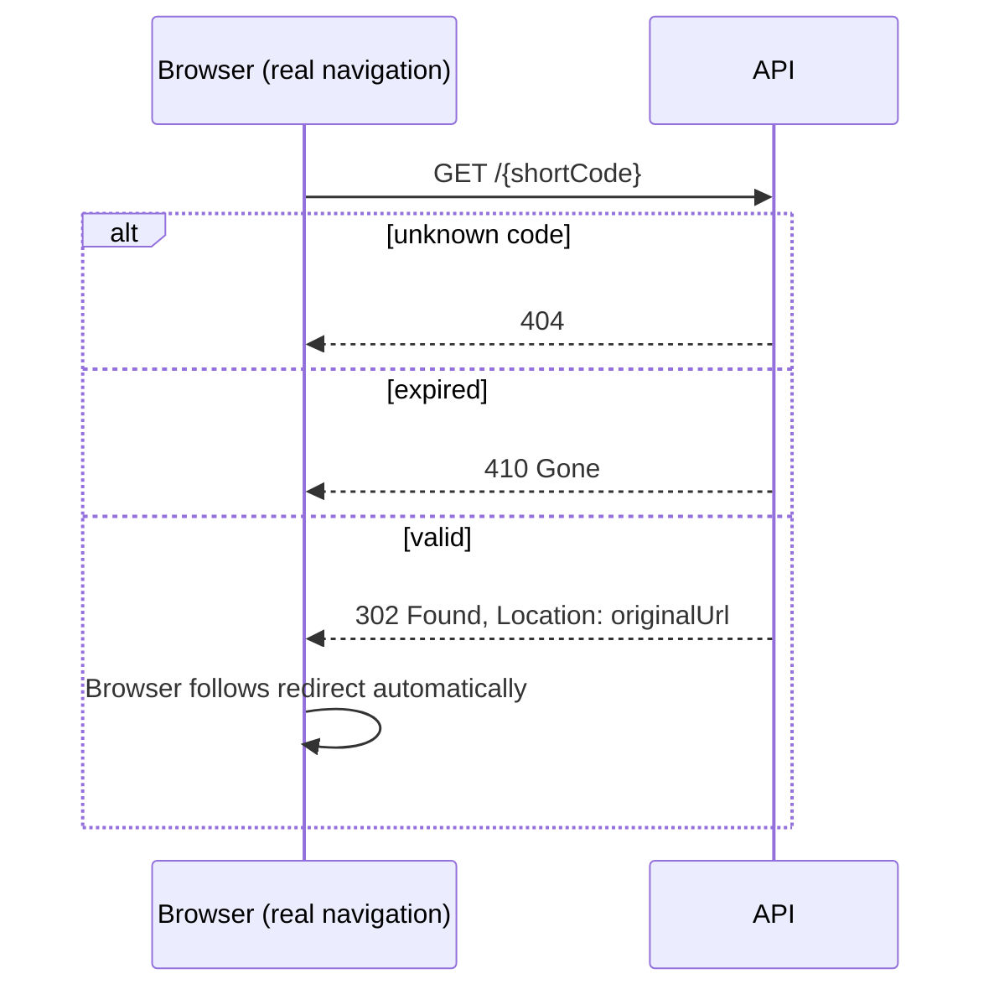
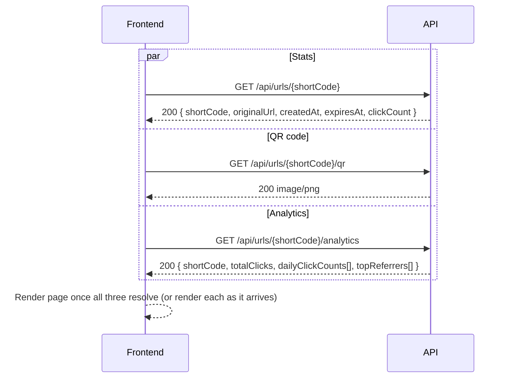
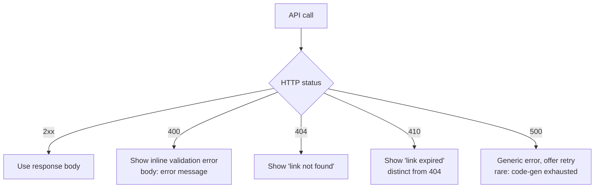

# API Flow — Frontend Implementation Guide

How the pieces fit together, call-by-call, so you can build a frontend against this
API without re-deriving it from `openapi.yml`. Read [`BACKEND.md`](./BACKEND.md) for
feature behavior, [`schemas.md`](./schemas.md) for exact field shapes, and
[`FRONTEND_INTEGRATION.md`](./FRONTEND_INTEGRATION.md) for gotchas/CORS setup first —
this doc is the "what calls happen in what order" layer.

Base URL: `http://localhost:8080`. No auth, no versioning prefix.

## Endpoint summary

| Method | Path | Purpose | Side effects |
|---|---|---|---|
| `POST` | `/api/urls` | Create (or dedupe) a short link | Creates a row, or returns the existing one |
| `GET` | `/{shortCode}` | Follow the link | 302 redirect, increments click count, records a click event |
| `GET` | `/api/urls/{shortCode}` | Read stats | None |
| `GET` | `/api/urls/{shortCode}/qr` | Get a QR code (PNG) | None |
| `GET` | `/api/urls/{shortCode}/analytics` | Read analytics breakdown | None |

Only the redirect endpoint has side effects. Stats, QR, and analytics are all safe to
call repeatedly, in any order, in parallel, or not at all.

## Flow 1 — Create a short link

The only flow that writes anything. Everything else reads from what this produces.



Request:
```json
POST /api/urls
{ "url": "https://example.com/long/path", "customAlias": "mylink12" }
```

Response (`201`):
```json
{
  "shortCode": "mylink12",
  "shortUrl": "http://localhost:8080/mylink12",
  "originalUrl": "https://example.com/long/path",
  "createdAt": "2026-07-08T10:15:30Z",
  "expiresAt": "2027-07-08T10:15:30Z"
}
```

**Things the frontend must handle, not assume:**
- Submitting the same URL twice returns the **same** `shortCode` — a `201` doesn't
  mean "always a new row." Don't be surprised if the response's `expiresAt` or
  `shortCode` doesn't match what you just requested (see "dedup" below).
- If `customAlias` was requested but already taken, the backend **silently** falls
  back to a generated code — always read `shortCode` from the response rather than
  assuming it equals what you sent. If you want to tell the user "your alias wasn't
  available," compare the response's `shortCode` to the `customAlias` you sent.
- `expiresAt` is never `null` in the response — if you didn't send one, the backend
  filled in a default. Don't render "never expires" unless you sent a far-future date
  yourself.
- Use `shortUrl` directly for display/copy. Don't reconstruct it from `shortCode` —
  the backend already resolves the host.

## Flow 2 — Someone follows the link

You generally **don't** call this from your app's own JS — it's what a browser does
when a user clicks the link (`<a href="{shortUrl}">` or a real navigation), or what
happens when a QR code is scanned.



If you need to check "does this link still work" from your app, **don't** call this
endpoint via `fetch`/XHR (it has side effects — it counts as a real click). Call the
stats endpoint (Flow 3) instead and compare `expiresAt` to the current time yourself.

## Flow 3 — Link details view (stats + QR + analytics together)

This is the flow for a typical "link details" page: once you have a `shortCode`
(either just-created, or looked up from wherever you stored it — see
`FRONTEND_INTEGRATION.md` on the "no listing endpoint" gotcha), fetch all three in
**parallel** — none of them depend on each other:



All three return `404` independently if the code doesn't exist — if you fire them in
parallel, handle each `Promise` separately rather than using something like
`Promise.all` that fails fast on the first rejection, or you'll lose the other two
results unnecessarily.

### Stats
```
GET /api/urls/{shortCode}
```
```json
{
  "shortCode": "mylink12",
  "originalUrl": "https://example.com/long/path",
  "createdAt": "2026-07-08T10:15:30Z",
  "expiresAt": "2027-07-08T10:15:30Z",
  "clickCount": 42
}
```
Returned even if expired — check `expiresAt` client-side if you want to show an
"expired" badge; the API won't refuse this call for an expired link.

### QR code
```
GET /api/urls/{shortCode}/qr
```
Raw `image/png` bytes, not JSON. Use directly as an image source:
```html

```
No caching headers are set — if you want to avoid re-fetching on every render, cache
the blob/URL client-side yourself. Works for expired links too (encoding the link
isn't the same as it still redirecting).

### Analytics
```
GET /api/urls/{shortCode}/analytics
```
```json
{
  "shortCode": "mylink12",
  "totalClicks": 42,
  "dailyClickCounts": [
    {"date": "2026-07-07", "count": 30},
    {"date": "2026-07-08", "count": 12}
  ],
  "topReferrers": [
    {"referrer": "https://twitter.com", "count": 25},
    {"referrer": "(direct)", "count": 17}
  ]
}
```
- `dailyClickCounts` only includes days with at least one click — no zero-filled gaps.
  If you're charting this, fill in missing dates as 0 yourself.
- `topReferrers` is capped at 10, descending by count. `(direct)` means no `Referer`
  header was present (or it was blank) — treat it as a real category, not an error.
- This endpoint doesn't exist for scope not covered here (no unique-visitor counts,
  no geography, no device breakdown) — see `BACKEND.md` → "Analytics" for exactly
  what's in and out of scope.

## Flow 4 — Error handling (applies to every endpoint)



Every non-2xx response has the same shape: `{ "error": "<human-readable message>" }`.
Branch on the **status code**, never the message text (it's not a stable contract).

## Putting it together: a minimal frontend page map

| Page/component | Calls | When |
|---|---|---|
| Create-link form | `POST /api/urls` | On submit |
| Link created / share view | (none — uses the `POST` response directly) | Immediately after create |
| Link details page | `GET /api/urls/{shortCode}` + `/qr` + `/analytics` in parallel | On page load, given a `shortCode` |
| QR display | `GET /api/urls/{shortCode}/qr` | Lazily, e.g. only when a "show QR" tab is opened |
| Analytics chart | `GET /api/urls/{shortCode}/analytics` | On page load or on a manual refresh action |

Since there's no listing endpoint (see `FRONTEND_INTEGRATION.md`), your frontend is
responsible for remembering which `shortCode`s a user has created (e.g. `localStorage`)
if you want a "my links" view — the API itself has no concept of ownership.
